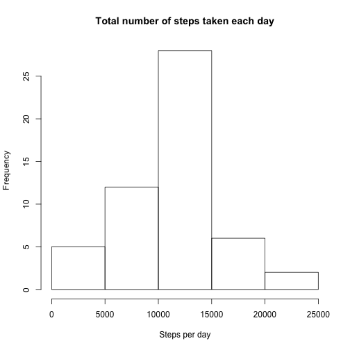
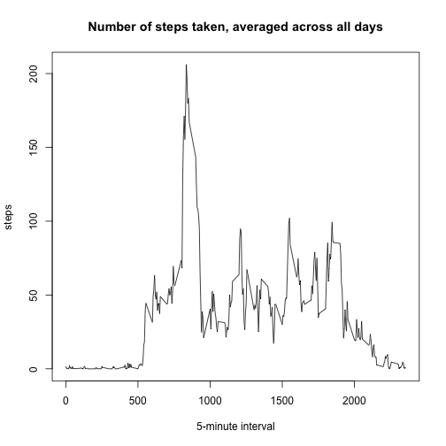
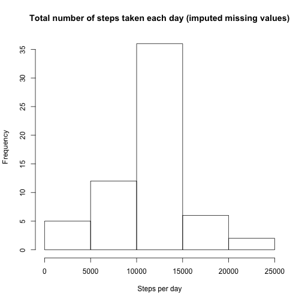
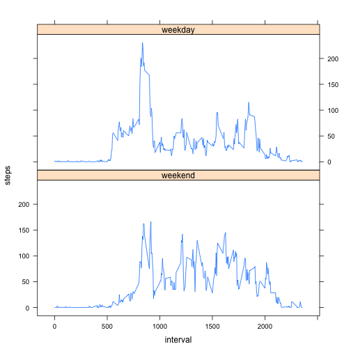

## Loading and preprocessing the data

Extract `activity.csv` file from the `activity.zip` archive and load it as `df` dataframe.


```r
df <- read.csv(unz("activity.zip", "activity.csv"), stringsAsFactors = FALSE)
```

Convert `data` variable from the class `character`to `Date`.


```r
df$date <- as.Date(df$date, "%Y-%m-%d")
```

## What is mean total number of steps taken per day?

Aggregate `df` dataset by `date`, store it in the dataframe `df_by_date`, and make a histogram of the total number of steps taken each day:


```r
df_by_date <- aggregate(steps ~ date, df, sum)
hist(df_by_date$steps,
     main = "Total number of steps taken each day",
     xlab = "Steps per day")
```

 

**Mean** total number of steps taken per day:


```r
mean(df_by_date$steps)
```

```
## [1] 10766.19
```

**Median** total number of steps taken per day:


```r
median(df_by_date$steps)
```

```
## [1] 10765
```

## What is the average daily activity pattern?

Aggregate `df` dataset by `interval`, store it in the dataframe `df_by_interval`, and make a time series plot of the 5-minute interval (x-axis) and the average number of steps taken, averaged across all days (y-axis).


```r
df_by_interval <- aggregate(steps ~ interval, df, mean)
with(df_by_interval, plot(x = interval,
                          y = steps,
                          type = "l",
                          main = "Number of steps taken, averaged across all days",
                          xlab = "5-minute interval"))
```

 

The following 5-minute interval, on average across all the days in the dataset, contains the maximum number of steps:


```r
df_by_interval[df_by_interval$steps == max(df_by_interval$steps),]$interval
```

```
## [1] 835
```

## Imputing missing values

There are missing values in the dataset. The total number of such values (i.e. the total number of rows with NAs) is as follows:

```r
sum(!complete.cases(df))
```

```
## [1] 2304
```

We will replace missing values by means for the 5-minute interval across all the days.

To create a new dataset with filled in missing values, first, make a clone of the original dataset and assign it to the `df_new` dataframe variable.


```r
df_new <- df
```

Then replace NA's by mean values from the previously calculated `df_by_interval` dataset.


```r
for(i in 1:nrow(df_new)) {
    if (is.na(df_new[i, "steps"])) {
        df_new[i, "steps"] <- df_by_interval[df_by_interval$interval == df_new[i, "interval"], "steps"]
        }
    }
```

Following is a histogram of the total number of steps taken each day.

```r
df_by_date_new <- aggregate(steps ~ date, df_new, sum)
hist(df_by_date_new$steps,
     main = "Total number of steps taken each day (imputed missing values)",
     xlab = "Steps per day")
```

 

New version of **mean** total number of steps taken per day, after imputing missing values:


```r
mean(df_by_date_new$steps)
```

```
## [1] 10766.19
```

New version of **median** total number of steps taken per day, after imputing missing values:


```r
median(df_by_date_new$steps)
```

```
## [1] 10766.19
```

We can see that the **mean** total number of steps taken per day did not change, due to our startegy which involves replacing NA's by means for the 5-minute interval. This does not make impact on **mean** calculations across the dataset.

In conrast, the **median** has changed because we changed the population involved into **median** calculation. 

## Are there differences in activity patterns between weekdays and weekends?

For this part we use the `df_new` dataset with the filled-in missing values. First, we add a new factor variable in the dataset with two levels -- "weekday" and "weekend" indicating whether a given date is a weekday or weekend day.

```r
weekday <- c("Monday", "Tuesday", "Wednesday", "Thursday", "Friday")
df_new$weekday <- factor(weekdays(df_new$date) %in% weekday, levels = c(FALSE, TRUE), labels = c("weekend", "weekday"))
```

Following is a panel plot containing a time series plot of the 5-minute interval (x-axis) and the average number of steps taken, averaged across all weekday days or weekend days (y-axis).

```r
xyplot(steps ~ interval | weekday, aggregate(steps ~ interval + weekday, df_new, mean), type = "l", layout = c(1,2))
```

 
